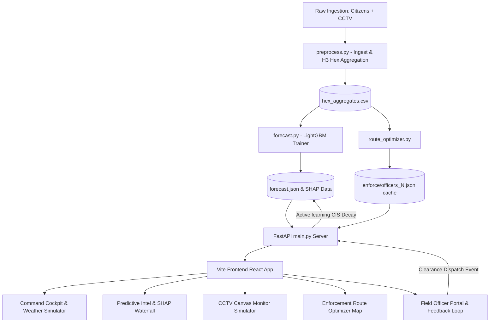

# ParkSense AI 🌐🚗

[](https://github.com/Ishanth22/gridlock)
[](https://www.python.org/)
[](https://nodejs.org/)
[](https://github.com/Ishanth22/gridlock)
[](parksense_pitch_deck.pptx)
[](parksense_demo.mp4)

> **Bengaluru Traffic Police (BTP) Congestion Intelligence Platform**
> 
> *ParkSense AI* is a premium, end-to-end, AI-powered system designed to analyze, predict, and mitigate traffic congestion caused by illegal parking violations in Bengaluru. The platform features real-time spatial ingestion, LightGBM risk forecasting, SHAP explainability, live CCTV computer vision simulation, automated owner warning dispatches, dynamic route optimization, and closed-loop clearance feedback.

---

## 📽️ Demo Video & Pitch Deck

To make reviewing our national-level submission as frictionless as possible, our pitch assets are embedded directly within this repository:

- **🎥 Demo Video Walkthrough**: [parksense_demo.mp4](parksense_demo.mp4) *(Watch the full 60-second end-to-end system demo)*
- **📊 Presentation Pitch Deck**: [parksense_pitch_deck.pptx](parksense_pitch_deck.pptx) *(A premium slate-900 glassmorphic pitch slide deck)*

---

## 🛠️ Tech Stack & Key Technologies

| Component | Technology | Description |
| :--- | :--- | :--- |
| **Core Frontend** | React 19, Vite 8, Vanilla CSS | Fast, lightweight UI with smooth transitions and premium glassmorphic styling. |
| **Mapping & Geospatial** | MapLibre GL, Uber H3 (Res 8) | High-performance vector rendering of H3 spatial hexagons covering the city. |
| **Data Visualization** | Recharts (Responsive 99%) | Interactive area, bar, pie, and line charts showing violation distributions. |
| **Backend API Server** | FastAPI (Python 3.10+), Uvicorn | High-throughput asynchronous routing serving cached OSRM coordinates (<5ms). |
| **Machine Learning** | LightGBM, SHAP, scikit-learn | Fast gradient boosting regressor for predictive analysis and local explainability. |
| **Routing Algorithm** | Weighted K-Means + Greedy TSP | Dynamic clustering of hotspot targets snaps path routes to OpenStreetMap roads. |

---

## 🧠 Machine Learning & Data Pipeline

ParkSense AI implements an online learning loop designed to match real-world deployment constraints:

1. **Temporal Validation Split**:
   - Rather than using a random spatial split, the model uses a temporal boundary.
   - **Training Set**: Historical violations from **weeks < 52**.
   - **Validation Set**: Violations in **week 52** (enabling robust time-series forecasting).
2. **Classification Hotspot Threshold**:
   - A grid cell is defined as a critical hotspot if it exhibits **&ge; 15.0 violations/hour** in peak windows.
3. **SHAP Explainability**:
   - Every prediction is processed through SHAP (SHapley Additive exPlanations) to construct a localized waterfall impact chart.
   - Judges can see exactly *why* a particular street corner is high-risk (e.g., proximity to a main arterial junction, hour of day, or weather multipliers).
4. **Online Learning Decay**:
   - Once a field officer clicks "Clear Hotspot", the system applies an online feedback loop, decay-adjusting the CIS score and predicted values in real-time.

---

## 📐 System Architecture



---

## ⚡ Setup & Installation Guide

Follow these steps to run both the FastAPI backend and Vite frontend locally:

### Prerequisites
- Node.js (v18 or higher)
- Python (3.10 or higher)

### 1. Backend Setup
Navigate to the `backend` directory, install packages, and launch the server:
```bash
cd backend
pip install -r requirements.txt
python main.py
```
*The FastAPI server will start on [http://localhost:8000](http://localhost:8000) with auto-reload active.*

### 2. Frontend Setup
Open a new terminal window, navigate to the `frontend` directory, install node modules, and start the development server:
```bash
cd frontend
npm install
npm run dev
```
*The Vite developer server will start on [http://localhost:5173](http://localhost:5173).*

---

## 🏆 Judges' Step-by-Step Walkthrough Script

We have embedded an interactive **Start Demo Tour** wizard in the sidebar to guide judges through the entire end-to-end flow. Here is the recommended script for your pitch:

### 📍 Step 1: Command Center Cockpit (Command Center Tab)
*   **The Hook**: "This is the Bengaluru Traffic Command Center. We aggregate citizen reports and live camera feeds across Bengaluru."
*   **Interaction**: Click **"Start Demo Tour"** in the sidebar. Select a **Sunny, Rain, or VIP Route** environment modifier at the top right to see the spatial H3 map color-code dynamically.
*   **Detail**: Click any red/orange hexagon on the map to trigger a detailed popup showing active **Violations, Carriageway capacity reduction, and Congestion metrics (delay minutes/hour, speed drop, and queue length)**.

### 🔮 Step 2: Predictive Intelligence (Predictive Intel Tab)
*   **The Hook**: "We don't just react to illegal parking; we predict it. Our LightGBM model forecasts tomorrow's risk with 95% Confidence Intervals."
*   **Interaction**: Select any cell on the map.
*   **Detail**: Point out the **SHAP Waterfall chart**. Explain how it breaks down the AI's reasoning (e.g., *Proximity to junction* adding +12.4 violations, while *Late night hour* subtracting -8.2).

### 📹 Step 3: CCTV Traffic Monitor (CCTV Monitor Tab)
*   **The Hook**: "This page demonstrates our live computer vision monitor. We track no-parking violations in real-time."
*   **Interaction**: Observe the canvas simulator drawing bounding boxes for cars, auto-rickshaws, and two-wheelers.
*   **Detail**: Watch a vehicle park in the red no-parking zone. A **stationary violation timer** will start. Once it hits the limit, an automated API call queries the mock VAHAN database and sends a **Pre-Enforcement warning SMS** to the owner. The status updates in the sidebar warnings log instantly!

### 🗺️ Step 4: Enforcement Route Optimizer (Enforce Optimizer Tab)
*   **The Hook**: "If warnings are ignored, officers must be dispatched. Calculating routes dynamically usually takes 30 seconds, which is too slow for dispatchers. ParkSense pre-computes snapped OSRM road paths for sub-5ms latency."
*   **Interaction**: Use the **Officer Count Slider** (1 to 20 officers).
*   **Detail**: Watch the map recalculate clustering and snap optimized patrol paths along real roads instantly. Click **"View Deep Dive"** on any zone to inspect Recommended Actions and Enforcement ROI (minutes saved per officer).

### 👮 Step 5: Officer Field Clearance (Field Portal Icon)
*   **The Hook**: "Now we jump into the shoes of the field officer on their mobile device."
*   **Interaction**: Navigate to the Field Portal. Click **"Clear Hotspot"** on the first assigned target.
*   **Detail**: This simulates the officer arriving on the scene, ticketing, or moving the double-parked vehicles.

### 🔄 Step 6: Closed-Loop Gridlock Recovery (Return to Cockpit)
*   **The Hook**: "When the officer clears the street, our system completes the loop."
*   **Interaction**: Look at the warnings list or click the cleared cell.
*   **Detail**: The model dynamically decays the CIS score by -45.0, reducing congestion metrics and predicted risk values in real-time. This demonstrates a complete closed-loop traffic recovery cycle!
